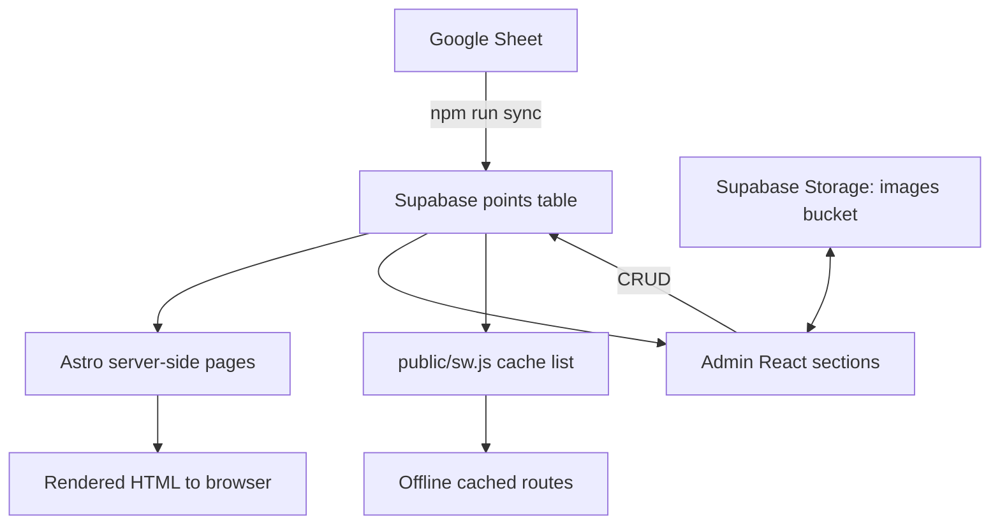

# Na Stezce Ceskem - Repository Guide

This repository currently contains one application in the `website` folder:

- Astro 5 web app
- Server-rendered pages (Vercel adapter)
- Supabase-backed content and admin
- PWA/offline support via service worker and manifest

Project focus: a practical hiking companion for the Orlicke hory stage of Na Stezce Ceskem.

## 1. Repository layout

```text
na-stezce-ceskem/
  website/
    src/
      pages/            # public pages, admin pages, API endpoints
      components/       # Astro UI components
      admin/            # React-based admin app + services + layout
      lib/              # shared data clients/helpers (Supabase, posts, settings)
      scripts/          # data sync/migration/injection scripts
      types/            # TypeScript domain models
      utils/            # mapping, grouping, slug helpers
      styles/           # global styles and design tokens
      docs/             # internal project docs/notes
    public/
      sw.js             # service worker (offline cache)
      manifest.webmanifest
    astro.config.mjs    # Astro + Vercel configuration
    package.json
```

## 2. Tech stack

- Astro 5 (`output: server`)
- React 19 (used mainly for admin UI)
- Supabase (database, storage, auth)
- Vercel adapter for Astro deployment
- ESLint + Prettier
- Google Sheets API (for source data sync)

## 3. How the app works

### Public site

- Pages under `src/pages` fetch data from Supabase directly (mostly server-side during Astro rendering).
- Main itinerary page (`/itinerar`) loads `points` and `point_details`, maps category/type values, and supports category filtering.
- Detail pages (`/bod/[slug]`) load grouped or standalone points, then load images from `point_details`.
- Blog pages load published posts from `posts` table via `src/lib/posts.ts`.
- FAQ page loads and filters published items from `faq` table.

### Admin

- Entry: `src/pages/admin.astro` -> `src/admin/AdminApp.tsx`
- Sections for FAQ, posts, settings, images, and point details
- Uses services in `src/admin/services/*` with Supabase client

### Offline / PWA

- `public/manifest.webmanifest` makes the app installable.
- `public/sw.js` pre-caches core pages/routes and uses network-first with cache fallback.
- Base layout registers service worker and shows online/offline status toasts.

## 4. Data flow



### Typical runtime flow

1. User requests a page.
2. Astro page fetches data from Supabase.
3. Astro renders HTML on server (Vercel runtime).
4. Browser loads page, service worker is registered.
5. Service worker serves cache fallback if offline.

### Content update flow

1. Admin updates FAQ/posts/settings/point details in admin UI.
2. Data is written to Supabase tables.
3. Public pages read fresh content on next render.

### Source sync flow

1. `npm run sync` reads Google Sheets rows.
2. Script maps row columns to point fields.
3. Script upserts rows into Supabase `points`.
4. Optional migration/injection scripts update detail/cache artifacts.

## 5. Main tables and types

Core interfaces are in `website/src/types`.

### Point (`src/types/point.ts`)

Represents an itinerary item/service point.

Important fields:

- `id`, `point_name`, `km`
- `category`, `type`
- GPS: `latitude`, `longitude`
- contact/service metadata: `phone`, `website`, `opening_info`, `note`
- grouping: `location_id`, `location_name`
- linked detail object: `details?: PointDetails`

### PointDetails (`src/types/pointDetails.ts`)

Per-point extended metadata:

- `point_id`
- contact/notes fields
- `images`
- `hikers_welcome`, `active`

### FAQ (`src/types/faq.ts`)

- `question`, `answer`, `category`
- `is_published`
- timestamps

### Post (`src/types/post.ts`)

- `title`, `slug`, `excerpt`, `content`, `cover_image`
- `is_published`
- timestamps

## 6. Environment variables

Create `website/.env` (or set in your deployment environment):

```env
# Public Supabase client access (used by Astro and browser-side code)
PUBLIC_SUPABASE_URL=
PUBLIC_SUPABASE_ANON_KEY=

# Required for Google Sheet sync script
SUPABASE_SERVICE_KEY=
GOOGLE_SERVICE_KEY=path/to/google-service-account.json
GOOGLE_SHEET_ID=
```

Notes:

- `PUBLIC_*` values are exposed to client-side code by design.
- `SUPABASE_SERVICE_KEY` must stay server-side/private.
- `GOOGLE_SERVICE_KEY` should point to a valid service account JSON file.

## 7. Local development setup (after clone)

From repository root:

```bash
git clone <your-repo-url>
cd na-stezce-ceskem/website
npm install
```

Then create/update env file:

```bash
cp .env .env.local 2>/dev/null || true
# or create .env manually if you prefer
```

Run dev server:

```bash
npm run dev
```

Build and preview:

```bash
npm run build
npm run preview
```

## 8. Commands reference

Run all commands inside `website`.

- `npm run dev` - start local Astro development server
- `npm run build` - production build
- `npm run preview` - preview built app
- `npm run lint` - run ESLint
- `npm run format` - format project with Prettier
- `npm run sync` - sync points from Google Sheets -> Supabase
- `npm run migrate` - migrate point fields into `point_details`
- `npm run inject` - inject detail page routes into service worker cache list

## 9. Important folders and responsibilities

- `src/pages`:
  - Public content pages (`index`, `itinerar`, `bod/[slug]`, FAQ, blog, project pages)
  - Admin entry pages (`admin.astro`, `admin/login.astro`, `admin/upload.astro`)
  - API endpoints (`api/login.ts`, `api/points.json.ts`)
- `src/admin`: React admin UI, sections and services
- `src/lib`: common Supabase clients and content query utilities
- `src/scripts`: maintenance/data scripts for sync and migration
- `public`: service worker, PWA manifest, static assets

## 10. Deployment notes

- Astro is configured with Vercel adapter in `astro.config.mjs`.
- Output mode is server (`output: "server"`).
- `vercel.json` sets caching headers for assets and routes.
- Ensure all required env vars are configured in Vercel project settings.

## 11. Operational checklist for new contributors

1. Install dependencies in `website`.
2. Configure environment variables.
3. Verify Supabase connectivity (open home page + itinerary).
4. Run lint/build before opening PR.
5. If offline cache routes changed, run `npm run inject` and verify `public/sw.js`.

## 12. Known implementation notes

- There is both a modern React admin surface (`/admin`) and a separate legacy upload page (`/admin/upload`).
- Some pages fetch directly from Supabase in page frontmatter, so missing env vars fail fast.
- Service worker strategy is network-first with cache fallback, not fully offline-first.
